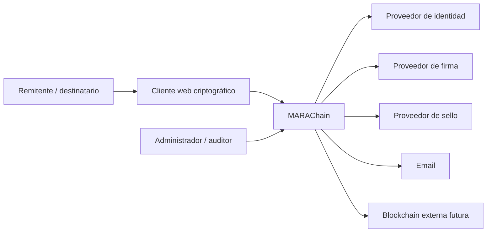
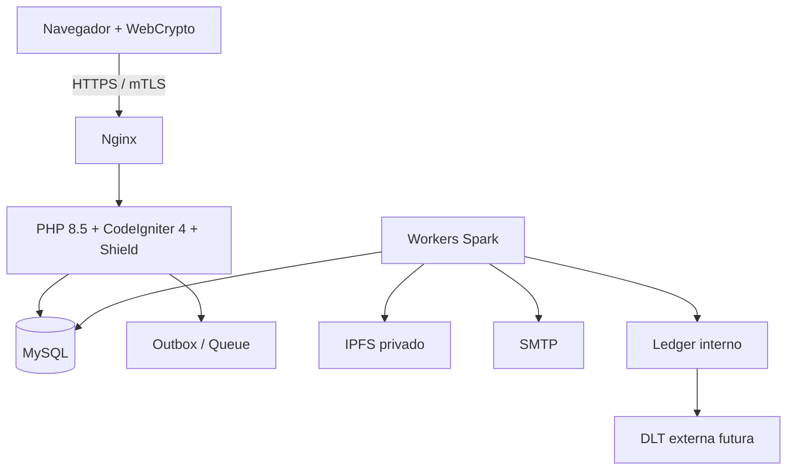
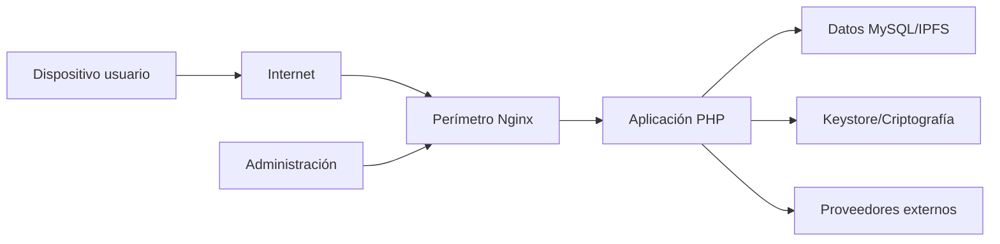
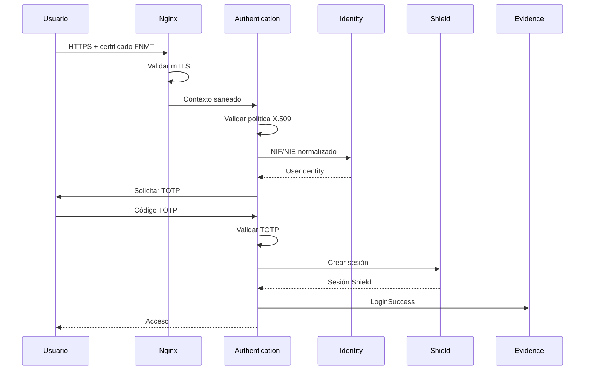
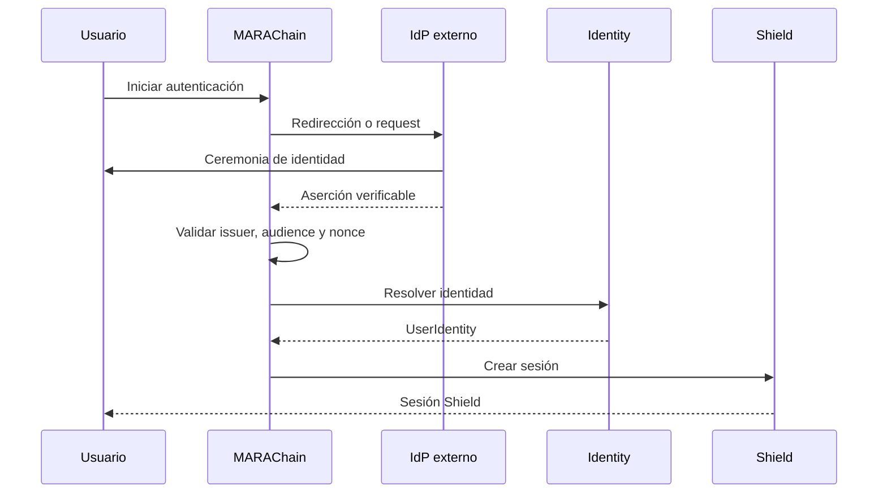
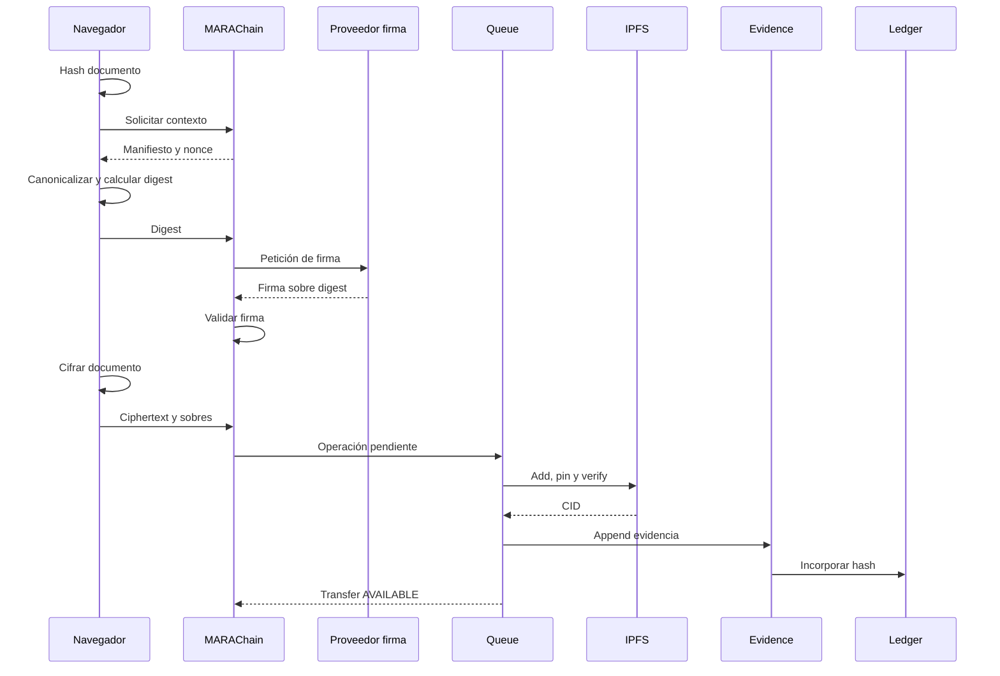
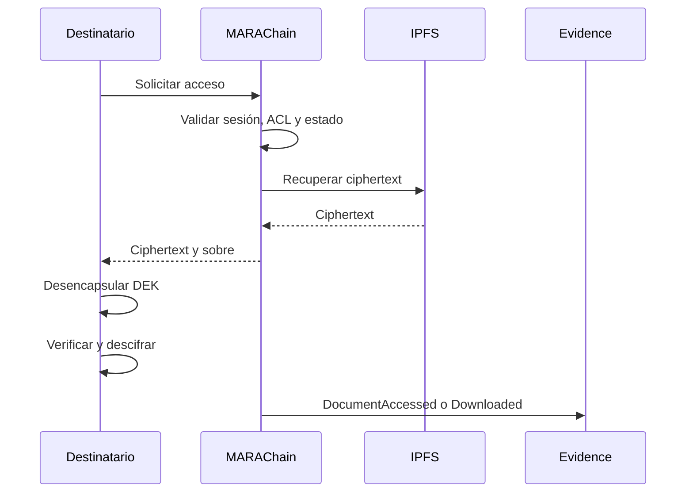
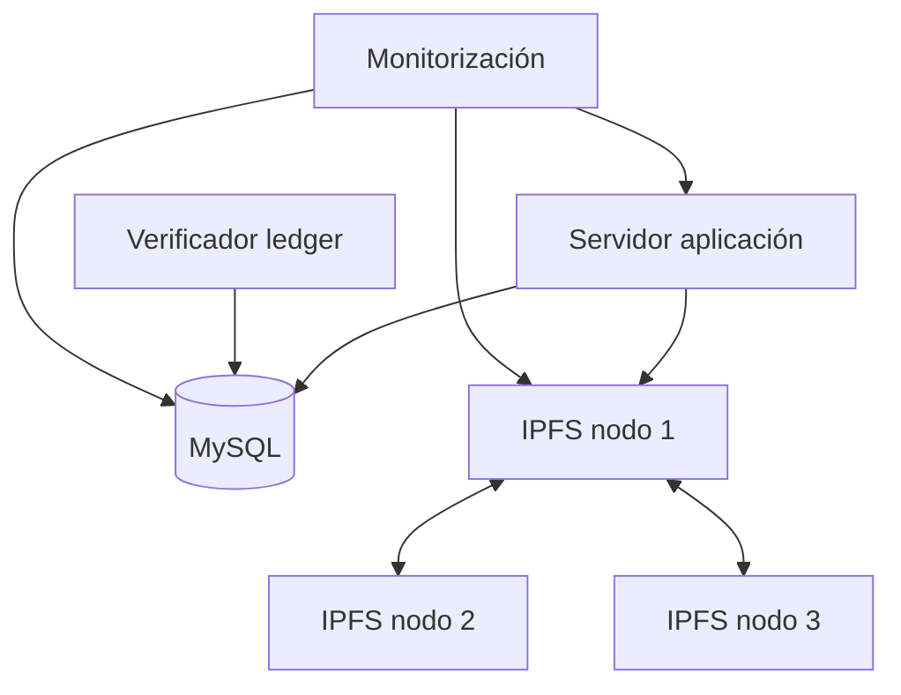
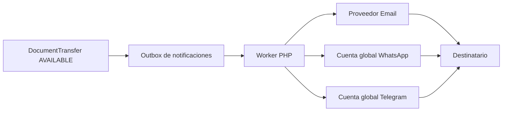

# MARAChain — Arquitectura

**Versión:** 1.2.0  
**Fecha:** 14 de julio de 2026  
**Estado:** Arquitectura de referencia aceptada  
**Clasificación:** Fuente de verdad

## 1. Estilo arquitectónico

MARAChain será un monolito modular.

Se combinarán:

- MVC en presentación;
- casos de uso en aplicación;
- dominio independiente;
- arquitectura hexagonal en límites externos;
- DDD táctico en módulos críticos.

```text
Presentation -> Application -> Domain
Infrastructure -> Ports
Domain -> sin dependencia de framework
```

## 2. Contexto C4



## 3. Contenedores C4



## 4. Módulos y ownership

| Módulo | Responsabilidad |
|---|---|
| Identity | identidad interna, NIF/NIE, proveedores y credenciales |
| Authentication | FNMT, IdP, TOTP y nivel de garantía |
| Session | integración Shield y sesiones |
| Documents | documentos, versiones y manifiestos |
| Encryption | formatos, suites y sobres |
| Signatures | intención, proveedor y validación |
| Transfers | destinatarios, ACL y estados |
| Evidence | evidencias canonicalizadas |
| Ledger | bloques, Merkle, firmas y checkpoints |
| Storage | IPFS, pins, réplicas y reconciliación |
| Notifications | email y cuentas globales corporativas de WhatsApp y Telegram, con adaptadores sustituibles |
| Organizations | tenants y representación futura |
| Administration | operaciones privilegiadas auditadas |
| Billing | planes y cuotas futuras |
| Frontend | navegación, vistas CI4, componentes Alpino, formularios y orquestación del cliente |

## 5. Agregados

- `UserIdentity`.
- `Device`.
- `Organization`.
- `Document`.
- `DocumentTransfer`.
- `SignatureRequest`.
- `EvidenceChain`.
- `LedgerBlock`.
- `StorageObject`.

## 6. Zonas de confianza



### Secretos por zona

- dispositivo: certificado FNMT, claves WebCrypto y TOTP;
- perímetro: clave TLS;
- aplicación: HMAC, cifrado de campos y credenciales;
- IPFS: `swarm.key`;
- ledger: clave Ed25519;
- release: clave de firma de artefactos.

Ninguna zona concentrará todos los secretos.

## 7. Flujo de autenticación fase 1



## 8. Flujo de autenticación fase 2



## 9. Firma y envío



## 10. Lectura



## 11. Cifrado

```text
Documento -> DEK -> AES-256-GCM -> Ciphertext
DEK -> Encapsulación por destinatario -> RecipientEnvelope
```

El backend no conocerá la DEK.

Formato inicial:

```json
{
  "format": "marachain-envelope",
  "version": 1,
  "contentCipher": "AES-256-GCM",
  "manifestHash": "sha256:...",
  "recipients": []
}
```

La encapsulación final se decidirá tras PoC.

## 12. Firma e identidad

Se mantendrán contratos independientes:

```text
IdentityProviderInterface
SignatureProviderInterface
TimestampProviderInterface
```

Un proveedor podrá implementar varios contratos, pero el dominio no dependerá de él.

## 13. Persistencia

Reglas:

- repositorio por agregado;
- no acceso directo a tablas ajenas;
- migraciones inmutables;
- PII cifrada;
- HMAC para búsquedas deterministas;
- evidencias y ledger append-only;
- estados mutables separados.

## 14. Eventos internos

Se utilizarán eventos de dominio y outbox.

Campos comunes:

- `eventId`;
- `eventType`;
- `schemaVersion`;
- `occurredAt`;
- `aggregateId`;
- `correlationId`;
- `causationId`;
- payload mínimo.

## 15. Ledger sustituible

```php
interface LedgerAnchorInterface
{
    public function anchor(
        LedgerCheckpoint $checkpoint
    ): AnchorReceipt;

    public function verify(
        AnchorReceipt $receipt
    ): VerificationResult;

    public function status(
        AnchorId $id
    ): AnchorStatus;
}
```

El ledger interno siempre existirá.

La blockchain externa recibirá raíces y checkpoints, no datos documentales directos.

## 16. Multitenencia

Preparación desde el MVP:

- `tenant_id` nullable;
- contexto tenant derivado de membresía;
- repositorios tenant-aware;
- pruebas de aislamiento.

La representación empresarial completa será posterior.

## 17. Despliegue

Topología inicial:



Rutas:

- `/var/www/marachain/current/public`;
- `/etc/marachain`;
- `/var/lib/marachain`;
- `/var/log/marachain`;
- `/etc/marachain/keystore`.

## 18. Alta disponibilidad

- PHP stateless;
- sesiones en MySQL inicialmente;
- workers escalables;
- IPFS replicado;
- ledger con líder o lock;
- backups MySQL;
- verificador independiente.

## 19. Supply chain

- lockfiles;
- SBOM;
- artefactos firmados;
- dependencias locales;
- sin CDN crítico;
- revisión de dos personas;
- actualizaciones firmadas;
- secret scanning.

## 20. Amenazas

### Activos

- identidades;
- documentos;
- DEK;
- claves;
- TOTP;
- sesiones;
- firmas;
- evidencias;
- ledger;
- backups;
- releases.

### Atacantes

- tercero remoto;
- usuario fraudulento;
- administrador malicioso;
- operador comprometido;
- proveedor externo;
- desarrollador o CI comprometido;
- malware local.

### Riesgos residuales

- pérdida irreversible;
- copias descargadas no revocables;
- metadatos observables;
- malware local;
- JavaScript manipulado;
- denegación de servicio;
- ausencia inicial de validación longeva.

## 21. Arquitectura de notificaciones globales

### 21.1. Contexto



Las cuentas pertenecen a MARAChain. Los usuarios remitentes no aportan sesiones ni credenciales de mensajería.

### 21.2. Límites de confianza

```text
Aplicación PHP
    ↓ referencia opaca
Secretos de infraestructura
    ├── sesión global WhatsApp
    └── sesión o credencial global Telegram
```

Las credenciales se mantienen fuera del webroot y se separan por entorno.

### 21.3. Contratos

```text
Notifications Domain
        ↓
NotificationProviderInterface
        ├── Email adapter
        ├── Global WhatsApp adapter
        └── Global Telegram adapter
```

El dominio no conocerá el SDK o protocolo concreto.

### 21.4. Semántica

- El mensaje identifica a MARAChain como emisor técnico.
- El contenido puede indicar quién es el remitente documental.
- La dirección WhatsApp o Telegram identifica el destino del aviso.
- Un acuse del canal no equivale a acceso, lectura ni aceptación.
- Los canales no conceden acceso documental.
- El documento nunca se transmite por estos canales.

### 21.5. Resiliencia

- outbox transaccional;
- reintentos con backoff;
- idempotencia;
- dead-letter;
- circuit breaker por proveedor;
- health checks;
- fallback por email;
- desactivación inmediata de un canal degradado.

## 22. Arquitectura frontend

### 22.1. Capas

```text
Vistas CodeIgniter 4
        ↓
Componentes y controladores UI
        ↓
Servicios JavaScript de aplicación
        ↓
Servicios criptográficos / Web Workers
        ↓
WebCrypto
```

Alpino será una base visual. No contendrá reglas de dominio ni lógica criptográfica.

### 22.2. Separación entre fuente comercial y runtime

```text
Plantilla original y documentación
resources/frontend/alpino/original/
        ↓ adaptación y saneamiento
Vistas CodeIgniter 4
wwwroot/app/Views/
        +
Assets seleccionados
wwwroot/public/assets/alpino/
        +
Lógica propia
wwwroot/public/assets/js/
```

`resources/frontend/alpino/` no formará parte del artefacto desplegable. Los HTML originales no serán servidos por Nginx ni accesibles desde el navegador.

La separación evita:

- desplegar demos o documentación;
- exponer componentes no utilizados;
- mezclar código comercial con lógica propia;
- incorporar plugins sin inventario;
- dificultar la actualización o sustitución de dependencias.

### 22.3. Navegación

```text
/inbox            -> transferencias recibidas
/outbox           -> transferencias enviadas
/transfers/new    -> nuevo envío
/transfers/{id}   -> detalle
/contacts         -> contactos
/evidence         -> evidencias
/profile          -> perfil
/settings         -> configuración
```

La ruta posterior a la autenticación será `/inbox`.

### 22.4. Pantallas Alpino de referencia

- Inbox: `mail-inbox.html`.
- Detalle: `mail-single.html`.
- Nuevo envío: `mail-compose.html`.
- Contactos: `contact.html`.
- Perfil: `profile.html`.
- Selector documental: `form-upload.html` y Dropzone.

Mapeo de referencia:

```text
mail-inbox.html  -> app/Views/inbox/index.php
mail-single.html -> app/Views/transfers/show.php
mail-compose.html -> app/Views/transfers/create.php
contact.html -> app/Views/contacts/index.php
profile.html -> app/Views/profile/show.php
form-upload.html -> componente integrado en transfers/create.php
```

### 22.5. Límite de confianza del cliente

El navegador es responsable del hashing, cifrado, gestión temporal de claves y descifrado. La plantilla no ejecutará directamente estas operaciones: invocará servicios JavaScript propios y versionados.

El fichero original no cruzará el límite del navegador antes de cifrarse.

## 23. ADR obligatorios

- lenguaje y framework;
- monolito modular;
- Shield;
- identidad por fases;
- firma por digest;
- cifrado WebCrypto;
- encapsulación;
- multidispositivo;
- ausencia de recuperación;
- IPFS;
- ledger;
- blockchain externa;
- multitenencia;
- cola MySQL;
- API fase 2;
- eliminación y crypto-erasure;
- adopción y saneamiento de Alpino Horizontal;
- flujo de subida Dropzone sin auto-upload;
- arquitectura JavaScript y Web Workers;
- modelo visual Inbox/Outbox basado en `DocumentTransfer`.
